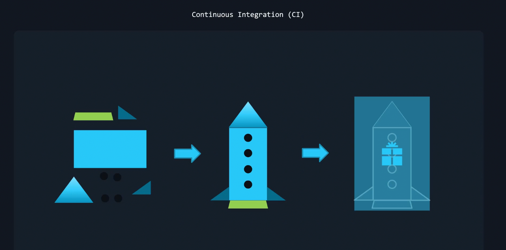
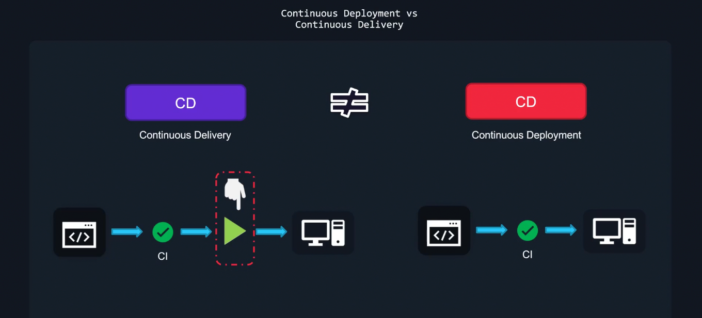
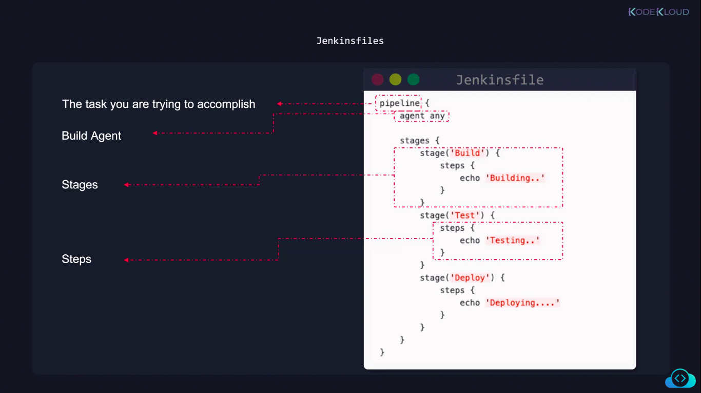
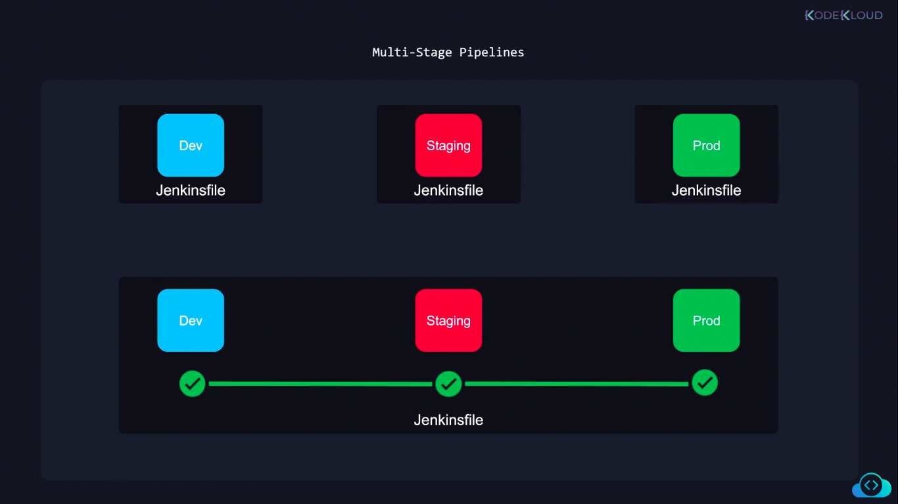

## CI/CD
### CI - Continuous Integration
* Packaging all the pieces of your application into a single component
* Ex: Creating a Docker image for your application
* All the tests (unit test, integration test) are carried out in the CI part


### CD - Continous Delivery/Deployment

### C Delivery vs C Deployment
* After the integration process, if someone has to initiate the deployment, it is C Delivery
    > Here, the deployment is automated, but somenone has to initate it
* Whereas if the deployment takes place automatically after CI is completed, it is C Deployment



## Jenkins
* Jenkins uses port 8080 by default (and also port 50000)
* Jenkins has a CLI that you can make use of
### Plugins
* Role-based authorization
    * For assigining roles to users, build agents like IAM
    * [Docs](https://plugins.jenkins.io/role-strategy/)
* BlueOcean
    * New UI for Jenkins
* SSH Build Agent
* Pipeline

## Jenkins Backup
* You need to backup your jenkin files to not lose your work
* 90% of important stuff to backup is present in `$JENKINS_HOME` directory
    * It contains `config` folder, consisting of `config.xml` files
    * It contains all your jobs (to build CI/CD pipelines)

* You can backup jenkins by:
    * Taking snapshots of your filesystem
    * Plugins for Backup. [*ThinBackup*](https://plugins.jenkins.io/thinBackup/) is one such plugin
        * For this, first you need to mention the directory to backup, in the settings
    * Running a [shell script](https://github.com/sue445/jenkins-backup-script) to backup jenkins instance 

## Monitoring Jenkins
* You can use several plugins to monitor Jenkins (metrics) | Ex: _Prometheus_
> https://www.jenkins.io/doc/book/system-administration/monitoring/

## Jenkinsfile
### About
* Something like a DockerFile. Contains intructions for your pipeline

* build agent is kinda where your pipeline runs


* In Multi-stage pipelines, if one stage files, it tries to rebuild the failed stage and proceeds to the next stage only if the build succeeds

### Syntax
```
environment{
    ...
}
```
* This is how you initialise environment variables

## Build Agents
* Build agents run the whole pipeline process
* A build agent can be a docker container, a Linux, windows or a Mac Machine or even a Raspberry. Its a complete different machine
* Java is the prerequisite for build agents 

### Steps to set up a build agent
* Choose a machine to run your build agent
    * Create a user and a password with sudo access in that machine
* Install `SSH Build Agent` plugin on your Jenkins server 

* Configure your jenkins server
    * Add credentials of the user, in the server your build agent is supposed to run on 
    * Add a node (build-agent node) and configure it 
> The build agent is accessed via ssh (if you've configured it that way)
* In your pipeline job, you should add the agent 
```
pipeline {
    agent {
        label "agents_label"
    }
}
```